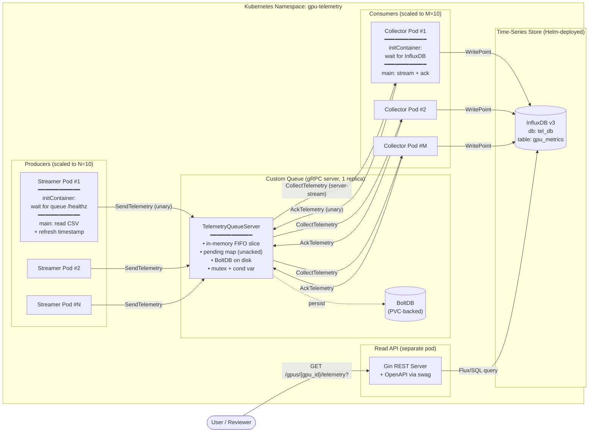

GPU Telemetry Pipeline


Note for reviewers: This document captures the architecture and key design decisions. Each major decision includes an expandable "Why this choice?" block for deeper context. Quickstart instructions are in `INSTALL.md`.


<b><h2>1. Overview & Goals </h2></b>

A horizontally scalable, available, and elastic telemetry pipeline that ingests GPU metrics, buffers them through a custom in-house message queue, and persists them to a time-series store for historical analysis.


The pipeline is designed considering GPU operations use cases such as detecting GPU failures and informing AI workload checkpoint migration decisions — scenarios where historical trend analysis will be needed


In Scope

Custom message queue implementation (no Kafka, RabbitMQ, NATS, etc.).
Producer (streamer) and consumer (collector) services.
Time-series persistence and historical query API.
Helm-based deployment to a local Kubernetes cluster (kind on macOS).
Clean code, structured logging, graceful lifecycle, and unit-test coverage of core logic.

Out of Scope (deliberate)

Real DCGM integration — the streamer replays a static CSV with refreshed timestamps to simulate live GPU metric emission.
UI / dashboards — a read-only REST API is sufficient for this exercise.
Multi-cluster / multi-region deployment.
Authentication / authorization on the data plane.
Quantitative load testing (functional correctness was prioritized; load characterization is listed in Section 8 as next step).

Non-functional Targets

| Property | Target | How achieved |
| :--- | :--- | :--- |
| **Scalability** | 10 streamer + 10 collector replicas | Stateless producers/consumers; queue is the only stateful component |
| **Availability** | Survive component restarts without data loss | At-least-once delivery + BoltDB persistence on the queue |
| **Elasticity** | Add/remove replicas without disruption | gRPC connection model; collectors auto-resume on reconnect |
| **Operability** | New hire installs in under 10 minutes from README | Single namespace, single Helm chart, no manual config |
| **Observability** | Component state visible from logs | Structured logs at every state transition (enqueue, dispatch, ack, requeue, reject) |


<b><h2>2. Architecture</h2></b>

2.1 Component Diagram



2.2 Data Flow Narrative

0. Bootstrap — On pod start, init containers gate the main container: streamer init waits for the queue to be up; collector init waits for InfluxDB's readiness endpoint. Only after these pass does the main container start, ensuring no wasted retry storms during cluster bring-up.

1. Ingest — Each streamer pod reads a CSV row, stamps it with time.Now(), and calls SendTelemetry (unary gRPC). On ResourceExhausted (queue full), the streamer retries with exponential backoff + jitter; if all retries fail, the message is dropped with a counter increment.

2. Buffer — The queue server appends the message to an in-memory FIFO slice and persists it to BoltDB before acknowledging the producer. A sync.Cond signals one waiting collector.

3. Dispatch — A collector holds an open CollectTelemetry server-stream. The queue assigns a UUID MessageId, moves the message from the FIFO into a pending map keyed by MessageId, and writes it on the stream.

4. Process — The collector writes the point to InfluxDB. Only on successful write does it call AckTelemetry(MessageId). The queue removes the message from pending and from BoltDB.

5. Recover — If no ack arrives within ACK_TIMEOUT_SECONDS (default 30s), a background goroutine moves the message from pending back to the FIFO. This handles collector crashes, InfluxDB failures, and lost ack RPCs.

6. Query — Reviewers hit GET /api/v1/gpus or api/v1/gpus/{gpu_id}/telemetry on the Gin REST API, which translates to a Flux/SQL query against InfluxDB. OpenAPI spec is auto-generated via swag init and served at /swagger/.


2.3 Why this shape?

Producer/consumer decoupling via gRPC server: streamers and collectors have independent lifecycles and scale independently. A streamer pod restart doesn't disrupt collectors and vice versa.

Single queue replica (for now): simpler reasoning about ordering and pending state. Production HA path is documented in Section 8.

Stateless producers/consumers: only the queue and InfluxDB are stateful. Adding/removing streamer or collector replicas requires no coordination.

At-least-once + idempotent sink: InfluxDB writes are idempotent on (measurement, tag-set, timestamp), so duplicate processing during requeue is harmless. This is what makes at-least-once cheap in this system.

Init containers enforce startup ordering: streamers wait on the queue's readiness before sending; collectors wait on InfluxDB readiness before consuming. This avoids a thundering-herd of failed RPCs at cluster bootstrap and removes flakiness from the new install experience.


<details><summary><b><h2>3. Component deep Breakdown</h2></b></summary>

3.1 Streamer (Producer)

Role: Simulate GPU metric emission by replaying a CSV with refreshed timestamps and pushing each row to the queue via gRPC.


Implementation highlights:


Reads CSV path, gRPC server address, and sleep interval from environment variables — all configurable per pod via Helm values.
Stamps time.Now().UnixNano() on each emission so InfluxDB sees fresh timestamps even though the CSV is static.
Tags each metric with the pod hostname (source_node=<pod-name>) so downstream queries can attribute load and verify all replicas are active.
Retry logic: on ResourceExhausted (queue full), Unavailable, or DeadlineExceeded, retries with exponential backoff + full jitter (100ms → 5s, max 5 retries). On final failure, drops the message and increments a counter — preserves forward progress instead of stalling the cycle.
After processing the full CSV, sleeps for SLEEP_DURATION_SECONDS and loops, providing continuous emission for as long as the pod runs.

Why backoff + jitter (not fixed retry)? With 10 replicas all hitting the queue, synchronized retries on a transient hot-spot would create a thundering herd. Full jitter spreads retry attempts uniformly, smoothing the load profile.
Init container uses nc -z <queue-host> <queue-port> to verify the queue's gRPC port is reachable before the main container starts. This is a TCP-reachability gate, not a deep health check — sufficient because the queue accepts connections only after its listener is bound and ready.


<details>
<summary><b>Why drop on final failure instead of buffering locally?</b></summary>

For telemetry, fresh data > complete data. A 5-second-old GPU temperature reading is rarely useful — the next reading will arrive momentarily. A local disk buffer would add complexity (file rotation, replay ordering, disk pressure) for marginal benefit. Drop-and-count keeps the streamer simple and surfaces saturation through metrics rather than hiding it. If a strict no-loss SLO existed, this is where I would add a local WAL.


</details>


3.2 Custom Queue (the centerpiece)

Role: A standalone gRPC service that buffers messages between producers and consumers, decoupling their lifecycles and providing at-least-once delivery with bounded memory and crash durability.


Three RPCs:

| RPC | Direction | Type | Purpose |
| :--- | :--- | :--- | :--- |
| `SendTelemetry` | Streamer $\rightarrow$ Queue | Unary | Enqueue a message; returns `ResourceExhausted` if at capacity |
| `CollectTelemetry` | Queue $\rightarrow$ Collector | Server-stream | Long-lived stream, queue pushes messages as they arrive |
| `AckTelemetry` | Collector $\rightarrow$ Queue | Unary | Confirm successful processing; queue removes from pending + BoltDB |


Internal state (single struct, mutex-protected):


```
messages      []message              // FIFO of ready-to-dispatch messages
pending       map[MessageId]pending  // dispatched but not yet acked
cond          *sync.Cond             // wakes waiting collectors
db            *bbolt.DB              // durable backing store
maxQueueSize  int                    // backpressure threshold
ackTimeout    time.Duration          // when to requeue unacked
```

The queue is detailed further in Section 5 (Custom Queue Deep Dive). This component breakdown only sketches the responsibility.


<details>
<summary><b>Why a single replica?</b></summary>

A single replica avoids the consensus problem entirely (no leader election, no replication lag, no split-brain). With BoltDB persistence, recovery from a pod restart is fast and lossless for already-enqueued messages. The trade-off is a brief unavailability window (~seconds) during pod restart, which is acceptable for this scale and exercise scope. A multi-replica HA path is documented in Section 8.


</details>


3.3 Collector (Consumer)

Role: Drain the queue, transform messages into InfluxDB points, write them, and acknowledge.


Implementation highlights:

Opens a long-lived CollectTelemetry stream on startup; if the stream errors or the queue restarts, the gRPC client reconnects.
For each received message:
Parses LabelsRaw into a tag map.
Builds an InfluxDB Point with (measurement, tags, fields, timestamp).
Writes synchronously with a 10s timeout.
Only on successful write, calls AckTelemetry(MessageId). On write failure, deliberately skips ack so the queue requeues the message after timeout.
Tracks counters for processed, writeFailed, ackFailed — surfaced in logs every 100 messages.

The ack discipline is the single most important rule in this component: ack must come after the durable write to InfluxDB, never before. Reversing this order silently breaks at-least-once.

Relies on the gRPC client's built-in reconnection (exponential backoff connection management via grpc.NewClient). On stream error, the collector exits and is restarted by Kubernetes; on transient connection issues, the underlying gRPC connection auto-recovers without intervention.

<details>
<summary><b>Why synchronous writes (not batched)?</b></summary>

InfluxDB v2 accepts batched writes for higher throughput, but batching complicates ack semantics: if a 100-point batch fails, which MessageIds do you skip-ack? You'd need to either ack none (re-process all 100, more duplicates) or track per-point success (complex). For this exercise, synchronous one-point writes keep the ack story clean. Batching is a Section 8 production improvement.


</details>


3.4 InfluxDB

Role: Durable time-series store for historical analysis.


Configuration:


Database: tel_db
Measurement (table): gpu_metrics
Deployed via Helm in the same namespace.
Storage backed by a PVC so data survives pod restarts.

What we store:


Tags (indexed): gpu_id, device, uuid, namespace, modelName, plus parsed labels_raw (e.g., source_node).
Fields: metric_name (string), value (float64).
Timestamp: streamer-assigned time.Now() at emission.

Idempotency property used by the system: writes with the same (measurement, tag-set, timestamp) are upserts. This is what makes at-least-once delivery safe — duplicate processing during requeue produces no observable effect.


3.5 REST API (separate pod)

Role: Read-only HTTP interface for querying historical metrics from InfluxDB. Provides a stable contract independent of the underlying time-series store and a discoverable schema for reviewers.


Implementation highlights:


Built on Gin for routing, middleware, and request binding.
OpenAPI spec auto-generated from struct tags using swag init and served via gin-swagger at /swagger/index.html.
Translates HTTP query parameters into Flux/SQL queries against InfluxDB.
Runs as a separate Deployment so the read path can be scaled and restarted independently of the write path.

Endpoints:

Method	Path	Purpose
GET	/api/v1/gpus	List all GPUs that have reported telemetry (distinct gpu_id values)
GET	/api/v1/gpus/{id}/telemetry	Return latest telemetry for a specific GPU
GET	/api/v1/gpus/{id}/telemetry?start_time=...&end_time=...	Time-range query for historical analysis

The time-range query is the primary value driver — it directly supports the "detect when a GPU went down" use case by letting operators retrieve the last N minutes of metrics around a suspected failure.


<details>
<summary><b>Why separate from the queue/collector?</b></summary>

Mixing read and write paths in the same pod creates coupled failure domains: a query storm could starve queue processing, or vice versa. A separate Deployment also lets us scale read replicas based on query load (different signal from telemetry ingestion rate) and restart the read API for a hotfix without touching the data-plane components.


</details>

</details>

<b><h2>4. Key Design Decisions & Trade-offs</h2></b>

This section captures the four most consequential choices made during the exercise, the alternatives considered, and the reasoning. Each decision lists the trade-off accepted — there is no "free" choice.


<h5>4.1 Custom Queue: gRPC server vs shared library</h5>

Decision: Build the queue as a standalone gRPC service with a dedicated pod, not as a Go library imported into streamer/collector binaries.


Alternative considered: A shared library exposing in-process channels or ring buffers, with streamer + collector co-located in the same pod.


Why gRPC server won:

| Dimension | Shared library | gRPC server (chosen) |
| :--- | :--- | :--- |
| **Lifecycle coupling** | Streamer crash takes down queue state | Independent pod lifecycles |
| **Scaling model** | Streamer and collector counts must match (1:1 in same pod) | Scale producers and consumers independently |
| **Failure isolation** | One process owns everything; OOM in any component kills the queue | Queue isolated; client crashes don't lose enqueued data |
| **Language reach** | All clients must be Go (or use CGo) | Any gRPC-supported language for future clients |
| **Deployment** | Tightly coupled rollouts | Independent rolling updates per component |


Trade-off accepted: Network hop and gRPC serialization cost (sub-millisecond at this scale, well under the per-message budget). For 10×10 replicas pushing telemetry every few seconds, this overhead is negligible compared to the operational benefits.


<details>
<summary><b>Why not Unix domain sockets or shared memory?</b></summary>

Both keep streamers and collectors co-located on the same node, defeating the elasticity requirement. Kubernetes scheduling doesn't guarantee co-location, and forcing it (via DaemonSets or node affinity) adds operational complexity that doesn't pay back at this scale.


</details>


<h5>4.2 Time-Series Store: InfluxDB vs Prometheus</h5>

Decision: Use InfluxDB as the persistence layer.


Alternative considered: Prometheus.


Why InfluxDB won:


Long-term retention. Prometheus is a monitoring system, not a long-term store. Its local TSDB targets ~15 days of retention; longer storage requires Thanos, Cortex, or remote-write to a separate system — extra moving parts. InfluxDB is designed for unbounded historical retention out of the box, which directly supports the stated use case of post-incident analysis ("when did the GPU go down, and was the AI checkpoint successfully migrated?").

Push vs pull model fit. Prometheus pulls; our streamers push. Adapting the pipeline to Prometheus would require either an exporter sidecar per queue or pushing through Pushgateway — which the Prometheus team explicitly recommends only for batch jobs, not continuous streams.

Idempotent writes. InfluxDB upserts on (measurement, tag-set, timestamp). This is the property that makes at-least-once delivery safe in our queue — duplicates are harmless. Prometheus, by contrast, treats out-of-order or duplicate samples as a hard error (out of order sample rejection). Our queue's requeue mechanism would produce these errors regularly.

Cardinality and tag model. Both handle our cardinality (~10 GPUs × handful of metrics) easily, but InfluxDB's flexible tag model accommodates the labels parsed from labels_raw without a fixed schema upfront.


Trade-off accepted: Prometheus has a richer alerting ecosystem (PromQL, Alertmanager). We forgo this. For this system, alerting is intentionally out of scope and would be added separately by exporting key metrics from the queue/collector to a Prometheus endpoint (Section 8 roadmap item).


<h5>4.3 Collector: Custom Go service vs Telegraf</h5>

Decision: Build a custom Go collector instead of using Telegraf.


Alternative considered: Telegraf with the InfluxDB output plugin and a custom input plugin reading from the gRPC queue.


Why custom Go won:


Future transformation needs. A production collector frequently needs in-flight enrichment that doesn't fit cleanly into Telegraf's input/processor/output plugin model. Concrete examples for this domain:

Joining GPU metrics with Kubernetes pod metadata (which workload owns this GPU at this timestamp?)
Computing derived metrics (e.g., 5-minute rolling utilization) before storage
Filtering by namespace allowlist for multi-tenant isolation
Mapping modelName to workload SLA tier for downstream prioritization
Each of these is awkward in Telegraf (custom plugins must be written in Go anyway, then loaded into Telegraf's runtime) and natural in a standalone Go service.

Ack discipline. The at-least-once contract requires precise control over when the ack RPC fires relative to the InfluxDB write. Telegraf's processor pipeline is asynchronous and batched; threading ack metadata through it cleanly is non-trivial. A purpose-built service makes the ordering explicit and testable.

Operational simplicity. One Go binary, one Helm chart, one set of logs. No Telegraf config TOML to learn, no plugin compatibility matrix to track across upgrades.


Trade-off accepted: We reimplement plumbing that Telegraf provides for free (metric formatting, retry, buffering). For this exercise the plumbing is minimal because the queue handles retry/buffering. At higher scale or with more output destinations (Kafka, S3, Elasticsearch in addition to InfluxDB), the calculus might shift toward Telegraf.


<details>
<summary><b>What if requirements were simpler — would Telegraf win?</b></summary>

Yes. If the collector were a pure pass-through with no transformation logic and only one output, Telegraf with a custom input plugin would be the better choice — less code to maintain. The decision flipped here on the assumption that production will require non-trivial transformation logic, which Telegraf's plugin model doesn't accommodate gracefully.


</details>


<h5>4.4 REST Framework: Gin vs net/http</h5>

Decision: Use Gin for the read API.


Alternative considered: Standard library net/http with gorilla/mux or hand-rolled routing.


Why Gin won:


OpenAPI auto-generation. The exercise required an auto-generated OpenAPI spec. Gin integrates cleanly with swag init, which parses Go struct tags and handler comments to emit Swagger 2.0 / OpenAPI 3.0 documents. With net/http, the spec must be hand-maintained or generated from a separate tool — extra surface area for drift.

Routing and middleware ergonomics. Path parameters, query binding, and middleware composition are first-class in Gin. With net/http, each requires custom code or a third-party router anyway.

Request binding and validation. c.ShouldBindQuery and struct-tag validation eliminate boilerplate for parsing start_time / end_time query params.


Trade-off accepted: A third-party dependency. Gin is mature, widely adopted, and actively maintained — the dependency risk is low. For an API surface with only 2 endpoints, the productivity gain is modest, but the OpenAPI auto-generation alone justifies the choice given the explicit requirement.


<b><h2>5. Custom Queue Deep Dive</h2></b>

The custom message queue is the centerpiece of this exercise. It is a single-replica gRPC service that buffers messages between producers and consumers, providing bounded memory, at-least-once delivery, and crash durability while remaining simple enough to reason about, test, and deploy.


This section walks through the queue's concurrency model, then the three production-readiness features that were explicitly designed in: backpressure, acknowledgement, and persistence.

<details>
<summary>Features of the queue</summary>

5.1 Concurrency Model

The queue's correctness depends on a small, deliberate concurrency primitive set: one mutex, one condition variable, one map, one slice. Everything else is built on top.


```
type TelemetryQueueServer struct {
    mu           sync.Mutex
    messages     []message              // FIFO of ready-to-dispatch
    pending      map[string]pendingMsg  // dispatched but not yet acked
    cond         *sync.Cond             // wakes waiting collectors
    closed       bool
    db           *bbolt.DB              // durable backing store
    maxQueueSize int
    ackTimeout   time.Duration
}
```

The locking discipline:


All mutations to messages, pending, or closed happen under mu.
cond.Wait() is called only from inside a held mu (standard Go cond-var pattern).
The lock is released before any network I/O (stream.Send) or disk I/O (BoltDB writes that aren't on the critical enqueue path), so other goroutines can make progress.

Why sync.Cond over channels:


A channel-based design (chan message) was considered and rejected. The reasoning:

| Property | Channels | sync.Cond (chosen) |
| :--- | :--- | :--- |
| **Single-reader semantics** | Natural | Natural |
| **Multiple-reader fan-out** | Natural | Requires careful `Signal()` vs `Broadcast()` |
| **Inspecting queue state (size, peek)** | Impossible — channels are opaque | Trivial — slice is directly accessible |
| **Conditional wake (close + non-empty)** | Requires `select` with sentinel | Single `for` loop with explicit predicate |
| **Persistence integration** | Awkward (channel buffer is opaque) | Natural (slice is iterable for crash recovery) |


The deciding factor was persistence and observability. With BoltDB recovery and high-water-mark logging, we need to inspect queue depth and iterate over pending messages — operations that are first-class on a slice but impossible on a channel.


5.2 Backpressure & Queue Size Limits

Problem: Without bounds, an unbounded messages slice grows until the queue pod OOMs and Kubernetes restarts it — losing all in-memory state and ack tracking.

Decision: Reject-on-full with gRPC ResourceExhausted, push the backoff burden upstream to the streamer.

How it works

On SendTelemetry, after acquiring mu:

```
go
if len(s.messages) >= s.maxQueueSize {
    s.rejectedCount++
    return &pb.TelemetryResponse{Success: false, Message: "queue full"},
        status.Error(codes.ResourceExhausted, "queue full")
}
```
The streamer handles ResourceExhausted with exponential backoff + full jitter (100ms → 5s, max 5 retries). After exhausting retries, the message is dropped with a counter increment. This means:


Bounded memory on the queue (hard cap at QUEUE_MAX_SIZE, default 50,000).
Bounded retry storms on the streamer (max 5 attempts × jittered backoff).
Visible saturation via rejectedCount metric and high-water-mark log line at 80% capacity.

Trade-off accepted

Producer-side complexity (retry/backoff logic) in exchange for queue-side safety. This is the right direction — pushing backpressure upstream is the standard pattern in production message systems (Kafka producers do the same on not_enough_replicas).


5.3 At-Least-Once Delivery (Acknowledgement + Requeue)

Problem: Without ack, a collector that crashes after receiving a message but before writing to InfluxDB silently loses that message. 


Decision: Implement at-least-once with a pending map and a timeout-driven requeue loop. InfluxDB's idempotent writes (upsert on (measurement, tag-set, timestamp)) make duplicate processing harmless.


Message lifecycle

```
                  ┌─────────────────────┐
   SendTelemetry  │                     │
   ─────────────▶ │   messages slice    │
                  │       (FIFO)        │
                  └──────────┬──────────┘
                             │ collector dequeues
                             │ + assigns MessageId (UUID)
                             ▼
                  ┌─────────────────────┐
                  │   pending map       │ ◀─── ack timeout (30s)
                  │  key: MessageId     │      ───────► back to messages
                  │  val: msg + sentAt  │      (requeueLoop)
                  └──────────┬──────────┘
                             │ AckTelemetry
                             │ (after InfluxDB write)
                             ▼
                          deleted
                          (also from BoltDB)
```

The three RPCs and their contracts

RPC	Contract
SendTelemetry	Returns success only after message is appended to messages AND persisted to BoltDB
CollectTelemetry	Server-stream; queue assigns MessageId, moves to pending, sends. Does not retry on stream send failure — relies on ack timeout
AckTelemetry	Idempotent: ack-of-unknown-id returns success (message was already requeued or acked); on known id, removes from pending and BoltDB

The collector-side discipline

Ack is sent only after the InfluxDB write succeeds. Never before.

The requeue loop

A background goroutine scans pending every 10 seconds:

```
go
for id, p := range s.pending {
    if time.Since(p.sentAt) > s.ackTimeout {
        delete(s.pending, id)
        p.msg.MessageId = ""  // will be reassigned on next dispatch
        s.messages = append(s.messages, p.msg)
        s.cond.Signal()
    }
}
```

Why duplicates are safe

InfluxDB writes with the same (measurement, tag-set, timestamp) are upserts — the second write overwrites the first identically. Since the streamer assigns the timestamp once at emission, requeue + reprocess produces the same point written twice, which is a no-op. This is what makes at-least-once cheap in this system.


If the sink were not idempotent (e.g., a counter that increments per message), at-least-once would require deduplication logic on the consumer side — a much more expensive design. The decision to use InfluxDB and the decision to use at-least-once are linked.


Failure scenarios covered

| Failure | Behavior | Outcome |
| :--- | :--- | :--- |
| **Collector crashes mid-processing** | No ack $\rightarrow$ 30s timeout $\rightarrow$ requeued to another collector | ✅ No loss |
| **InfluxDB write fails** | Collector skips ack $\rightarrow$ requeued | ✅ No loss |
| **Ack RPC fails (write succeeded)** | Requeued $\rightarrow$ reprocessed $\rightarrow$ idempotent duplicate write | ✅ No loss, no observable effect |
| **Collector slower than 30s per message** | Premature requeue $\rightarrow$ duplicates | ⚠️ Tune `ACK_TIMEOUT_SECONDS` |
| **Queue pod restart** | In-memory pending lost — but messages restored from BoltDB | ✅ See 5.4 |


5.4 Persistence (BoltDB)

Problem: Pure in-memory queues lose all enqueued messages on pod restart. For a single-replica queue, this is the dominant data-loss risk.


Decision: Persist messages to BoltDB on enqueue; delete on ack. On startup, reload outstanding messages from BoltDB into the in-memory messages slice.


Why BoltDB

The choice was made on three criteria — operational simplicity, pure-Go compatibility, and fit-for-purpose.

For this queue's workload — balanced enqueue/ack with modest throughput — BoltDB's B+tree fits cleanly. It also keeps the container image small and the build reproducible (no CGO).

The choice was made on operational simplicity, not on benchmarking against alternatives. For a higher-throughput production queue, BadgerDB's LSM-tree design would be worth evaluating because LSM trees absorb write bursts more gracefully. At this exercise's scale, BoltDB is sufficient.

Persistence model

A single bucket, messages, with MessageId (or a sequence number for not-yet-dispatched messages) as the key and JSON-encoded message as the value.

```
go
// On SendTelemetry — persist BEFORE acknowledging producer
err := s.db.Update(func(tx *bbolt.Tx) error {
    b := tx.Bucket([]byte("messages"))
    encoded, _ := json.Marshal(msg)
    return b.Put([]byte(msg.persistenceKey()), encoded)
})
// only then: append to s.messages, return success to producer

// On AckTelemetry — delete AFTER removing from pending map
s.db.Update(func(tx *bbolt.Tx) error {
    return tx.Bucket([]byte("messages")).Delete([]byte(messageId))
})
```
Crash recovery

On startup, before serving any RPCs:

```
go
s.db.View(func(tx *bbolt.Tx) error {
    return tx.Bucket([]byte("messages")).ForEach(func(k, v []byte) error {
        var m message
        json.Unmarshal(v, &m)
        s.messages = append(s.messages, m)
        return nil
    })
})
```

After recovery, the queue resumes accepting and dispatching as if nothing happened. In-flight pending state is intentionally not persisted — on restart, those messages reappear in messages (because they were never deleted from BoltDB; only ack triggers deletion), and they will be re-dispatched and reprocessed. Idempotent InfluxDB writes make this safe.


Trade-off accepted

Every enqueue now does a synchronous fsync (BoltDB's Update is durable). This is the dominant per-message cost — typical fsync latency is 1-10ms on local disk, much higher than in-memory append. For this exercise's throughput requirements, the latency is acceptable. At higher throughput, batched persistence (group commit) would be the natural optimization: accept N messages in memory, fsync them as a single transaction, ack all N producers. Documented as a Section 8 roadmap item.


5.5 Graceful Shutdown

Problem: A SIGTERM during message processing can leave dispatched-but-unacked messages in-flight, partial BoltDB transactions, or producers blocked on a closing connection.


Decision: Coordinated shutdown with three phases.


```
Signal received (SIGTERM/SIGINT)
        │
        ▼
Phase 1: Stop accepting new producer messages
   - Set s.closed = true under mu
   - SendTelemetry returns Unavailable for new requests
        │
        ▼
Phase 2: Drain consumers
   - cond.Broadcast() wakes all collectors
   - Each collector loop sees (closed && empty) and exits cleanly
   - In-flight pending messages remain in BoltDB (will be redispatched on next start)
        │
        ▼
Phase 3: Stop background work
   - close(stopRequeue) signals requeue goroutine to exit
   - wg.Wait() ensures it has finished
   - grpcServer.GracefulStop() drains in-flight RPCs
   - db.Close() flushes BoltDB
        │
        ▼
Final stats logged: enqueued, rejected, acked, requeued, queue_remaining, pending_remaining
```

The key property: no message is lost during shutdown. Messages still in messages are in BoltDB; messages in pending are also in BoltDB (only acks delete them); both reload on next startup.


5.6 What the Queue Deliberately Does Not Do

To keep the design honest, here is what the queue is not:


Not implemented	Why deferred	Where addressed
Partitioning by key (e.g., gpu_id)	Single-mutex FIFO is sufficient at exercise scale; idempotent sink absorbs minor reordering	Section 8
Consumer groups	All collectors share one logical queue; load balancing is implicit (Signal() wakes one)	Section 8
Replication / multi-replica HA	Adds Raft/Paxos complexity; single replica + persistence covers data loss; brief unavailability on restart is acceptable	Section 8
Prometheus metrics endpoint	Counters are logged, not scraped; observability roadmap	Section 8
Message replay / retention after ack	Once acked, messages are deleted; no historical replay capability	Section 8

These are intentional scope cuts, not oversights. Each has a clear path forward and is documented in the production roadmap.
</details>
<b><h2>6. Operational Concerns</h2></b>6

6.1 Deployment

The entire system is deployed via a single Helm chart to a kind cluster on macOS. All components run in the gpu-telemetry namespace.

```
bash
# One-command install (see INSTALL.md for prerequisites)
helm install gpu-telemetry ./charts/gpu-telemetry -n gpu-telemetry --create-namespace
```

6.2 Configuration

All runtime configuration is environment-variable driven, surfaced through Helm values:


Component	Variable	Default	Purpose
Streamer	GRPC_SERVER_ADDR	(required)	Queue endpoint
Streamer	CSV_FILE_PATH	dcgm_metrics_*.csv	Source data
Streamer	SLEEP_DURATION_SECONDS	10	Inter-cycle pause
Streamer	MAX_RETRIES	5	Backpressure retry budget
Queue	GRPC_SERVER_ADDR	:50051	Listen address
Queue	QUEUE_MAX_SIZE	10000	Backpressure threshold
Queue	ACK_TIMEOUT_SECONDS	30	Requeue trigger
Queue	BOLTDB_PATH	/data/queue.db	Persistence file (PVC-backed)
Collector	GRPC_SERVER_ADDR	(required)	Queue endpoint
Collector	INFLUXDB_URL	http://influxdb:8181	Sink endpoint
Collector	INFLUXDB_TOKEN	(required)	Auth
Collector	INFLUXDB_ORG	ai_org	Tenant
REST API	INFLUXDB_*	(same as collector)	Read access
REST API	HTTP_PORT	8080	Listen port

6.3 Startup Ordering

Init containers enforce dependency readiness so the system bootstraps cleanly even on a cold cluster:


Pod	Init container	Waits for
Streamer	nc -z <queue> <port>	Queue's gRPC port reachable
Collector	TCP probe on InfluxDB	InfluxDB ready to accept writes
Queue	(none — root of dependency graph)	—
REST API	TCP probe on InfluxDB	InfluxDB ready to accept queries

This eliminates the retry-storm pattern that normally shows up at cluster bring-up, where every pod hammers a not-yet-ready dependency and fills logs with errors. New hires see a clean startup sequence on first install.


6.4 Logging

Structured logs at every state transition:


Enqueue — message ID, queue depth, max size
Dispatch — message ID, pending count
Ack — message ID, total acked, pending remaining
Requeue — message ID, time waited, deliveries count
Reject (backpressure) — queue size, total rejected
High-water mark — fires at 80% capacity
Shutdown stats — final counters for forensic analysis

Logs are plain log package output for now. Migration to structured JSON logging (zap or slog) is a roadmap item.


6.5 Health & Readiness

The queue exposes a TCP-reachable gRPC port that doubles as its readiness signal — the streamer init container's nc -z probe is sufficient because the gRPC server only binds the port after internal initialization (BoltDB recovery, requeue loop start) is complete. A dedicated /healthz HTTP endpoint is a roadmap item for a more nuanced health story (BoltDB write latency, queue depth thresholds).


<b><h2>7. Testing Strategy</h2></b>

7.1 What is covered

Unit tests cover the core queue logic and gRPC handlers at ~51% line coverage:


SendTelemetry — happy path, nil request, server-closed, queue-full backpressure rejection.
CollectTelemetry — single message dispatch, multiple-collector fan-out, graceful exit on shutdown.
AckTelemetry — known message, unknown message (idempotent success), missing message ID.
Concurrency invariants — multiple producers + multiple consumers, verifying no message is lost or double-dispatched under contention.
State transitions — enqueue → pending → ack → deletion; enqueue → pending → timeout → requeue.

gRPC streaming is tested using mock streams that implement the TelemetryServiceClient,TelemetryService_CollectTelemetryClient interface, allowing assertions on dispatched messages without a real network.


7.2 What is not covered

End-to-end integration with real InfluxDB — currently smoke-tested manually via the kind deployment, not automated.
BoltDB persistence corner cases — partial writes, disk full, file corruption.
Helm chart deployment validation — no helm test hooks yet.
Network failure injection — collector reconnection on queue restart, streamer behavior on network partition.
Quantitative load testing — throughput, p99 latency, backpressure behavior under sustained pressure.

7.3 Coverage framing

The 51% number reflects deliberate prioritization: core queue logic and gRPC handlers are tested; integration and persistence layers are next. With more time, the next investments would be:


Integration tests in a kind cluster, exercising the full data path with assertion on InfluxDB content.
Chaos tests killing the collector mid-process and verifying requeue + reprocessing.
Property-based tests for queue invariants (no loss, FIFO ordering within a producer, eventual consistency under arbitrary interleavings).
Load tests with ghz (gRPC benchmarking) to characterize throughput and latency curves.


<b><h2>8. Known Limitations & Production Roadmap</h2></b>

The current implementation prioritizes correctness, observability of state, and operational simplicity over production-grade scalability and HA. The gaps are deliberate. This section enumerates them with the path forward.


8.1 Quantitative load characterization

Throughput, latency percentiles, and backpressure thresholds were not measured. Functional correctness was prioritized within the exercise time budget. Next: ghz-driven benchmarks at increasing producer counts, recording p50/p95/p99 send latency and the queue size at which ResourceExhausted begins to fire.


8.2 Partitioning by key

A single mutex-protected FIFO serializes all enqueues and dequeues. At exercise scale (10×10 replicas, telemetry every few seconds) this is not a bottleneck, but for production with 1000+ GPUs it would become contention.


The fix is partitioning by gpu_id hash: N independent FIFOs, each with its own mutex and condition variable. Benefits:


Eliminates lock contention across partitions.
Preserves per-GPU ordering (important if downstream consumers do streaming derivatives or trend detection — a property InfluxDB upserts don't preserve).
Enables per-partition collector affinity (consumer-group semantics).

8.3 Consumer groups

All collectors today share one logical queue. There is no group concept — load balancing happens implicitly via cond.Signal() waking one waiter. This works for homogeneous collectors but doesn't support patterns like:


Multiple independent downstream sinks (e.g., one group writing to InfluxDB, another to S3).
Different processing rates per group with independent backpressure.

A consumer-group implementation would require a group registration RPC and per-group pending maps.


8.4 Replication and HA

Single-replica queue means a pod restart causes a brief unavailability window (~seconds to recover from BoltDB). Production HA would require either:


Active-passive with a shared persistent volume and leader election (simpler, lower throughput).
Active-active with consensus (Raft) where each replica owns a partition and replicates to followers (Kafka model — significantly more complex).

For this exercise, the brief unavailability + persistence-backed recovery was the right trade-off.


8.5 Prometheus metrics endpoint

Counters (enqueuedCount, rejectedCount, ackedCount, requeuedCount) are emitted via logs, not scraped. Production deployment would expose /metrics on the queue, collectors, and streamers, with a Prometheus + Grafana stack for dashboards. Note: this is monitoring Prometheus (operational metrics about the pipeline itself), not a replacement for InfluxDB (which stores the telemetry data).


8.6 Batched persistence

Every enqueue does a synchronous BoltDB fsync (1-10ms). Group commit — accumulate N messages in memory, fsync as one transaction, ack all N producers — would amortize this cost at the price of slightly higher per-message latency under low load.


8.7 Helm chart subchart split

Single chart was optimized for new-hire install. Production would split into umbrella + subcharts (queue, collectors, streamers, REST API, InfluxDB) to enable independent versioning and reuse outside this stack.


8.8 Structured logging

Plain log package output suffices for an exercise. Production should migrate to slog or zap with JSON output for log aggregation pipelines.


8.9 Auth on the data plane

gRPC calls between streamer/queue and collector/queue are unauthenticated. Production would add mTLS via SPIFFE / cert-manager.


8.10 Message TTL and replay

Messages are deleted on ack with no historical retention at the queue layer (InfluxDB retains the data, but the queue cannot replay). For DR scenarios where InfluxDB itself fails, queue-side retention with a configurable TTL would provide a replay window.


<b><h2>9. Quickstart</h2></b>

See `INSTALL.md` for full instructions.
